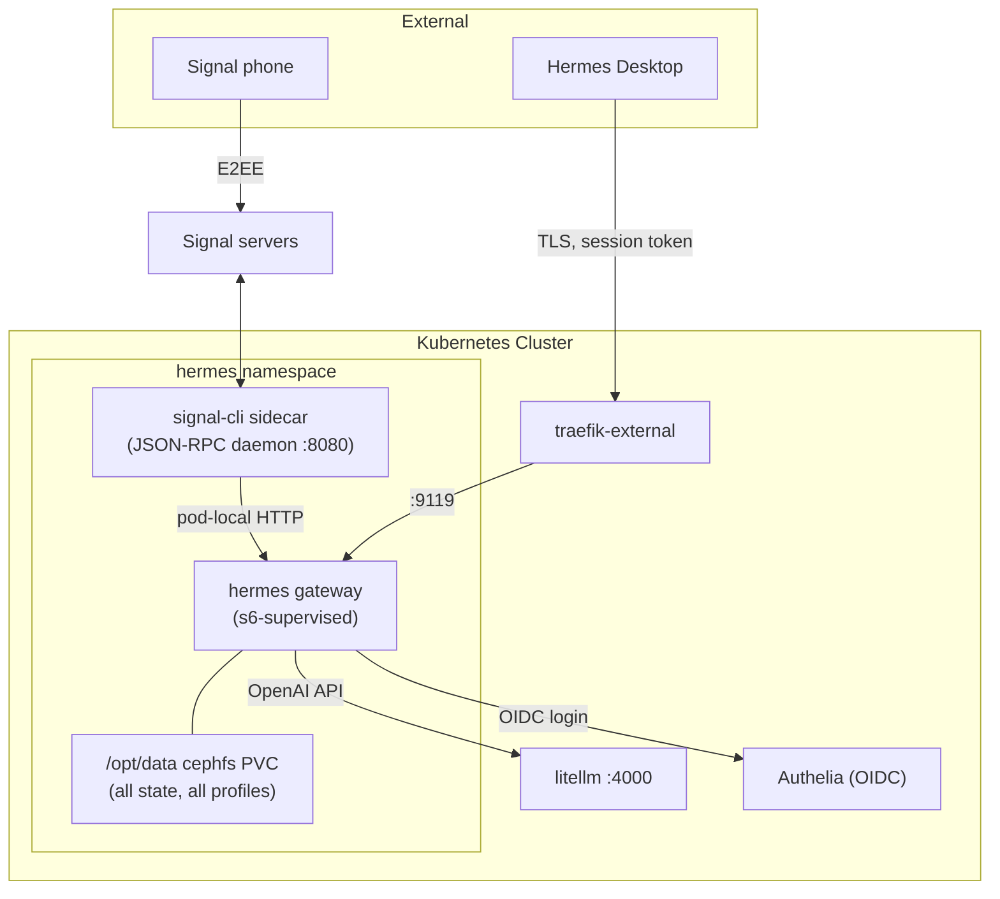

# Hermes Agent

[Hermes Agent](https://hermes-agent.nousresearch.com/docs/user-guide/docker) (Nous Research) runs as a sandboxed, GitOps-managed workload in the Talos cluster. Primary persona is `forge`, a tech lead for the homelab; additional agents (fitness, planner, etc.) are added as Hermes profiles inside the same container.

- **Hostname:** `hermes.bhamm-lab.com` (dashboard, via traefik-external)
- **Namespace:** `hermes`
- **Manifests:** `kubernetes/manifests/apps/ai/hermes/`
- **LLM backend:** cluster-internal [LiteLLM](index.md) via OpenAI-compatible env vars (`OPENAI_BASE_URL`, master key via ExternalSecret)
- **Messaging:** Signal via a `signal-cli` sidecar (linked device, group chat only)

## Architecture

Key design constraints from the upstream image:

- The image is s6-supervised and starts as root; a stage2 hook chowns `/opt/data` and drops services to the `hermes` user (UID 10000). No `runAsNonRoot`/drop-ALL securityContext — stage2 needs the caps. Namespace is PSA `privileged`, matching other app namespaces.
- **Never run two gateway containers against the same data dir.** The Deployment is `replicas: 1` with `strategy: Recreate`.
- Port 9119 serves the dashboard (Hermes Desktop remote gateway + web UI). Auth is Hermes-native self-hosted OIDC against Authelia (public PKCE client, no client_secret). No forward-auth middleware — same pattern as harbor/vault.
- Port 8642 (OpenAI-compatible API server) is reserved; `API_SERVER_KEY` exists in Vault but the port is not exposed.

## Signal integration

Signal runs as a sidecar container (`ghcr.io/asamk/signal-cli`, JVM tag — the GraalVM `-native` build mangles QR output, see signal-cli #2073) in single-account daemon mode on `:8080`. Hermes reaches it via the `hermes` Service, not loopback (separate container netns).

- Session data lives on the `hermes-signal-cli` rbd PVC at `/var/lib/signal-cli` (note: with `--config`, account data is at `<config>/data/accounts.json`, not the `$HOME` default).
- Channel policy: DMs (including Note-to-Self) are dropped (`SIGNAL_ALLOWED_USERS=none`); a dedicated "hermes" Signal group is the only live channel (`SIGNAL_GROUP_ALLOWED_USERS`). Group authz relies on a backport of upstream PR #44706, mounted via `authz-patch-configmap-green.yaml` — tied to the pinned image digest; regenerate on image bump, delete once the PR ships.
- **Linking** is built into the sidecar entrypoint: if no account exists on the PVC, it runs `signal-cli link` and logs the `tsdevice:` URI. QR-ify locally (`qrencode -t ANSIUTF8 '<uri>'`) and scan from the phone; the same process then execs the daemon. Do not run `signal-cli receive`/`listAccounts` while the daemon is up — concurrent access corrupts the account DB.

### Boot race (known issue)

The gateway connects to signal-cli once at startup and the JVM daemon is slower to boot, so the Signal adapter can fail on cold pod starts. The gateway retries and eventually reconnects; messages sent during the gap are dropped. If it appears stuck, bounce the gateway process (`kubectl exec` → kill the `hermes gateway run` PID; s6 restarts it).

## Networking

`networkpolicy-green.yaml` holds the cluster's first CiliumNetworkPolicies (default-deny once applied):

- **Ingress:** traefik pods → 9119 only
- **Egress:** kube-dns, litellm:4000, traefik (443 + 8443, for the Authelia OIDC token exchange), the hermes Service :8080 (signal-cli), and `world:443` for Signal servers

Note: Cilium's DNS proxy does not populate FQDN state on this cluster, so `toFQDNs` rules grant nothing — Signal egress uses `world:443` until that is fixed. Agent web tools (browser/curl/git) are blocked by the default-deny; append explicit rules per profile as needed.

## Operations

- **Config changes:** `hermes config set` writes `/opt/data/config.yaml` but does not reload the running gateway — restart the pod (or kill the gateway PID) to apply. This bit us with `model.api_mode chat_completions`: llama-server rejects Responses-API payloads (`Cannot determine type of 'item'`), and the fix did not take effect until a restart.
- **Backups:** k8up backs up both PVCs (`hermes-data` cephfs RWX, `hermes-signal-cli` rbd RWO).
- **Secrets:** `secrets.enc.json` → Vault sync workflow → ExternalSecret (`OPENAI_API_KEY` reuses the LiteLLM master key, open-webui pattern).
- **Image upgrades:** both images pinned by digest; Renovate proposes updates. Regenerate the authz patch ConfigMap on hermes image bumps.
