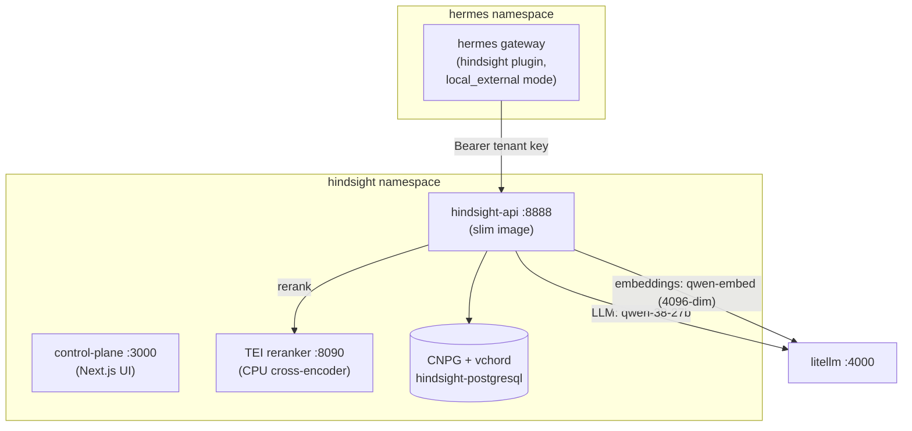

# Hindsight Memory

[Hindsight](https://hindsight.vectorize.io) (Vectorize) is the agent memory service backing Hermes' `memory.provider: hindsight`. It retains/recalls/reflects over long-term memory: fact + entity extraction on every retained turn, knowledge graph, temporal + semantic + keyword retrieval (RRF-fused + cross-encoder rerank), consolidated observations.

- **Hostname:** `hindsight.bhamm-lab.com` (Control Plane UI, behind Authelia)
- **Namespace:** `hindsight`
- **Manifests:** `kubernetes/manifests/apps/ai/hindsight/`
- **API:** `http://hindsight-api.hindsight.svc.cluster.local:8888` (ClusterIP only, tenant-key auth)
- **Tracking:** [issue #338](https://codeberg.org/blake-hamm/bhamm-lab/issues/338)

## Architecture



Key design points (all verified against the chart 0.10.2 templates / image contents during [#338](https://codeberg.org/blake-hamm/bhamm-lab/issues/338) planning):

- **Slim image** (`hindsight-api:0.10.2-slim`): built without the `local-ml` extra — no torch/sentence-transformers/flashrank inside the image, so embeddings and reranking MUST be external providers. Embeddings = `qwen-embed` through LiteLLM; reranker = the chart's own CPU TEI deployment (one flag, chart wires the env); LLM = `qwen-38-27b` for every operation (retain/consolidation/reflect) via LiteLLM.
- **vchord, not pgvector**: qwen-embed emits 4096-dim vectors; pgvector indexes cap at 2000 dims (storage only, no index). CNPG runs the immich-proven `cloudnative-vectorchord:17.5-0.4.3` image with `vchord.so` preloaded; `HINDSIGHT_API_VECTOR_EXTENSION=vchord`. Verified during bootstrap: plain `vchord` is sufficient — `vchord_bm25` is NOT required by Hindsight's backend. The `postgresql.managed.roles` superuser grant on the `hindsight` role is PERMANENT (not a bootstrap temp): the API's startup `CREATE EXTENSION vchord CASCADE` pulls in pgvector (untrusted), which needs superuser on every fresh-schema bootstrap; password stays CNPG-managed (immich precedent).
- **Secret round-trip**: the Helm chart hard-requires a Secret key `postgres-password` (secretKeyRef — no env-only escape). The DB password is CNPG-generated, pushed to Vault by `push-secret-prod.yaml` (PushSecret → `/default/hindsight-db`, its own path so the SOPS `kv put` sync can't clobber it), then pulled back by the common-chart ExternalSecret which remaps it to `postgres-password` and adds the tenant key + LiteLLM master key. Vault ACL is already sufficient: the `default` k8s auth role (used by the ESO store) carries `allow_secrets` (`secret/*` full CRUD, defined in `base/vault/cr-all.yaml`). Zero plaintext passwords in git; `secrets.enc.json` only holds `TENANT_API_KEY` (`vault_secrets.default.hindsight.TENANT_API_KEY`, generated with `openssl rand -hex 32`). Boot ordering is eventually-consistent by design: ES resolves the DB password minutes after first provisioning.
- **Backups**: barman → Ceph RGW (CNPG plugin). `restore.enabled` must stay `false` outside an actual restore test (flips bootstrap to recovery-from-backup).
- **NetworkPolicy**: none in the hindsight ns (convention); hermes' default-deny egress policy carries the explicit `hindsight:8888` rule instead.

## Hermes integration

The first-party memory-provider plugin (moved out of Hermes core 2026-09-23):

```bash
hermes plugins install hindsight     # catalog-pinned; lands on the hermes-data PVC
```

Per profile (inside the pod, `~/.hermes/hindsight/config.json` or `hermes memory setup`):

- `memory.provider: hindsight` (exclusive provider — activation is NOT `plugins enable`)
- `bank_id_template: "hermes-{profile}"` → one memory bank per profile (forge/mint/peak)
- `memory_mode: hybrid` → auto-recall before each turn + auto-retain after, plus `hindsight_retain/recall/reflect` tools
- `timeout: 240` — the plugin's client default (120s) trips while `qwen-embed` cold-starts from zeroscaling (wake takes minutes; retain waits on the server-side extraction round-trip client-side). 240s is the settled value.
- **PITFALL (multiplex gateway):** with `gateway.multiplex_profiles: true` the plugin resolves `HINDSIGHT_MODE` / `HINDSIGHT_API_URL` / `HINDSIGHT_API_KEY` through the per-profile secret scope (fail-closed `get_secret`), so the pod-level env from the Deployment is **inert**. Without these three in the profile's own `.env`, the plugin silently falls back to its built-in `http://localhost:8888` default and every retain/recall fails with connection refused. Activation per profile = append the trio to `profiles/<p>/.env` (API key = the same `/default/hindsight` tenant key):

  ```bash
  HINDSIGHT_MODE=local_external
  HINDSIGHT_API_URL=http://hindsight-api.hindsight.svc.cluster.local:8888
  HINDSIGHT_API_KEY=<tenant key>
  ```

- Done 2026-10-01: all 7 profiles (default/forge/mint/peak/ghost/ranch/bugbug) migrated — flat-file `MEMORY.md`/`USER.md` seeded into their banks once (dedup + secret-line exclusion), then `memory.memory_enabled: false`, `memory.user_profile_enabled: false`. Session transcripts are untouched — session history keeps working.
- Plugin updates are manual and per-profile (checkout lands in each profile's home): `hermes -p <profile> plugins update hindsight` (`hermes update` does NOT move it).
- **Bank missions (parked):** `retain_mission`/`observations_mission`/`reflect_mission` are null (defaults); consolidation occasionally drops a fact's subject. Note if this is ever tuned: the plugin 1.1.0 reads `bank_mission`/`bank_retain_mission` from `config.json` but never applies them (dead code path) — missions must be set on the **bank** via the Banks API (`GET/PUT /v1/default/banks/<bank>/config`), which is naturally per-profile.

## Runbook

- **UI:** Authelia → `hindsight.bhamm-lab.com` (banks, memory browsing, recall playground).
- **Tenant key rotation:** regenerate (`openssl rand -hex 32`) in `secrets.enc.json` at `vault_secrets["/default"].hindsight.TENANT_API_KEY` → CI syncs to Vault → ExternalSecrets refresh both consumers (hindsight + hermes) within 30m; restart hermes pods to force.
- **DB password:** owned by CNPG — `kubectl -n hindsight edit cluster hindsight-postgresql` or CNPG's own rotation flows; PushSecret re-pushes within ≤1h refresh (or force by restarting the PushSecret reconcile).
- **Auth gotcha:** LiteLLM auth uses the master key via `Authorization: Bearer` (Blake's deliberate choice). If LiteLLM ever rejects Bearer for master, fix = `/key/generate` a virtual key + swap the two `LITELLM_*` remoteRefs in `common-prod.yaml`.
- **Cold-boot ordering:** right after provisioning, the ExternalSecret/PushSecret pair converges on its own (ES NotReady for a few minutes is expected, not an incident).
