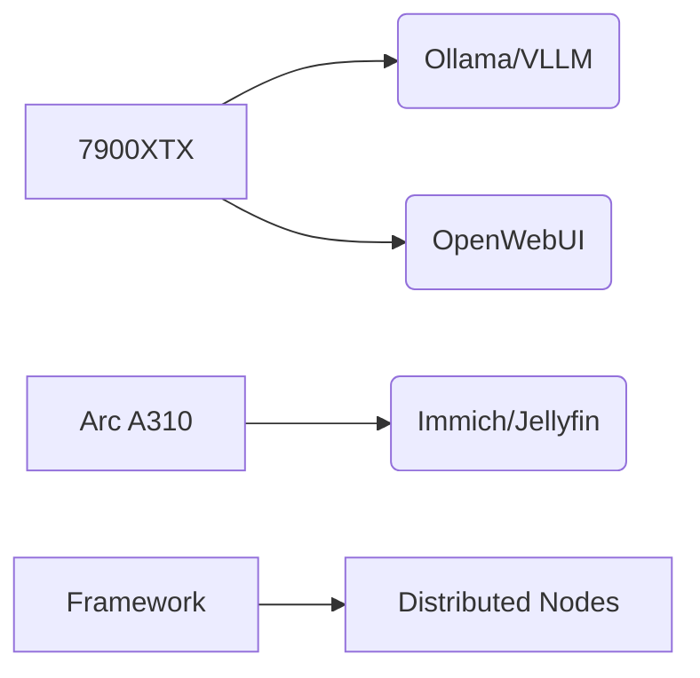

# AI Infrastructure

*Planning phase for homelab AI capabilities*

## Hardware Roadmap
- **Primary GPU**: AMD 7900 XTX
  - Hosting: Ollama/VLLM + OpenWebUI
- **Secondary GPU**: Intel Arc A310
  - Media: Encoding for Jellyfin
  - Light ML workloads for Immich
- **Compute Nodes**: Framework Motherboards (pre-ordered)
  - Distributed AI workloads

## Planned Stack

## Cloud Integration
- **Vertex AI API** for:
  - Overflow workloads
  - Specialized models
  - Temporary scaling

## Implementation Status
- 🚧 **Not started** - All plans conceptual
- PCIe passthrough configuration pending

**Next Steps**:
  - Setup Intel ARC A310 on Super node
  - Setup pcie passthrough and new talos VM with taint
  - Install Intel gpu k8s operator
  - Schedule immich and jellyfin to tainted Node
