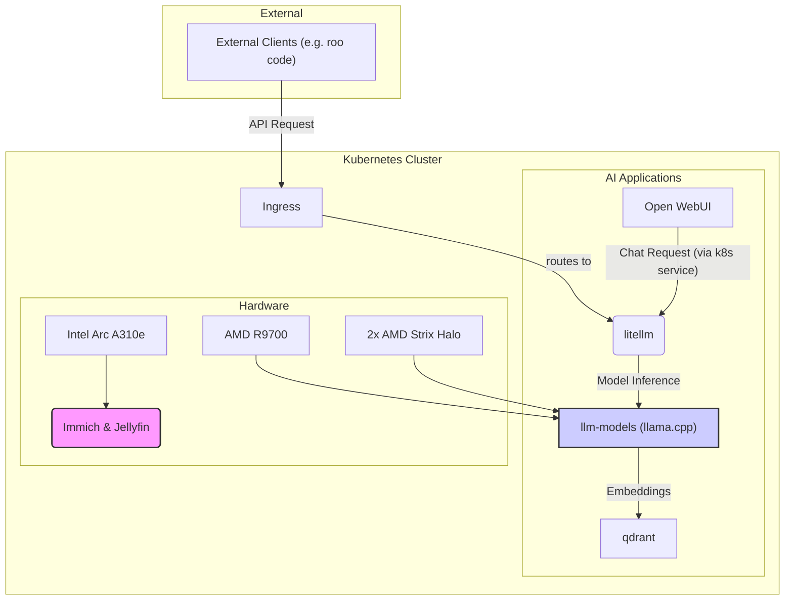

# AI Infrastructure

This document outlines the architecture of the homelab's AI infrastructure, which is designed to be a flexible and powerful platform for experimenting with and running various AI models.

## Hardware

The AI infrastructure is powered by a combination of specialized hardware to handle different workloads:

- **Intel Arc A310e:** This GPU is dedicated to media-related AI tasks. It powers [Immich](https://immich.app/) for machine learning-based photo management (facial recognition, object detection) and [Jellyfin](https://jellyfin.org/) for video transcoding, leveraging the Intel GPU plugin for Kubernetes.

- **AMD R9700:** This GPU is the workhorse for running local language models. It's primarily used for the `qwen-embed` model running on `llama.cpp` with the AMD GPU plugin, providing embedding capabilities for the entire stack.

- **2x AMD Strix Halo:** These are powerful APUs that are used for running larger, more demanding language models, also using the AMD GPU plugin.

## Software Stack

The software stack is built on Kubernetes and leverages a set of interconnected components to provide a seamless experience for interacting with the AI models.

- **`llm-models` Helm Chart:** This in-house chart is the core of the model deployment strategy. It automates the deployment of `llama.cpp` instances for various models, handles model caching to a local PVC, and enables scale-to-zero functionality using `kube-elasti`. This allows for efficient resource management, as models are only loaded into memory when they are actively being used. It also maps models to a `LiteLLM` configmap.

- **`llama.cpp`:** This is the inference engine used to run the language models. It is highly optimized for running on various hardware, including the AMD GPUs used in this setup.

- **`litellm`:** This provides a unified OpenAI-compatible API for all the deployed models. It acts as a central gateway, routing requests to the appropriate `llama.cpp` instance based on the model name. This allows any application that can talk to the OpenAI API to use the local models. It is also exposed externally for use by other applications, such as `roo code`.

- **`Open WebUI`:** This is the primary user interface for interacting with the language models. It's a user-friendly chat interface that connects to `litellm`'s OpenAI-compatible endpoint.

- **`qdrant`:** This is the vector database used for storing and searching embeddings. The `qwen-embed` model generates embeddings for various data sources, which are then stored in `qdrant` to enable semantic search and other retrieval-augmented generation (RAG) tasks.

## Diagram

The following diagram illustrates the flow of information between the various components of the AI infrastructure:

