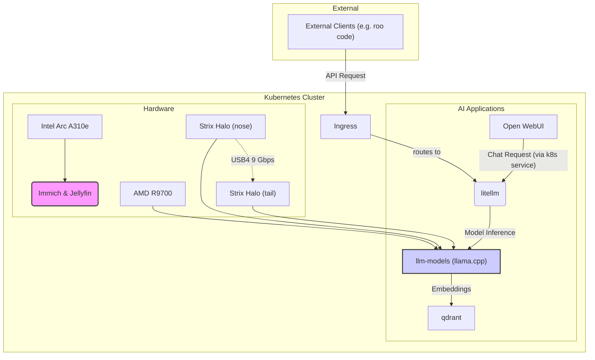

# Overview

This document outlines the architecture of the homelab's AI infrastructure, which is designed to be a flexible and powerful platform for experimenting with and running various AI models.

## Hardware

The AI infrastructure is powered by a combination of specialized hardware to handle different workloads:

- **Intel Arc A310e:** This GPU is dedicated to media-related AI tasks. It powers [Immich](https://immich.app/) for machine learning-based photo management (facial recognition, object detection) and [Jellyfin](https://jellyfin.org/) for video transcoding, leveraging the Intel GPU plugin for Kubernetes.

- **AMD R9700:** This GPU is the workhorse for running embedding models. It's primarily used for the `qwen-embed` model running on `llama.cpp` with the AMD GPU plugin, providing embedding capabilities accross my stack.

- **2x AMD Ryzen AI MAX 395+ (Strix Halo):** These powerful APUs are connected via a USB4 point-to-point mesh network (`10.30.0.78/32` ↔ `10.30.0.79/32`, ~9 Gbps) for distributed inference. Individually, they run larger language models using the AMD GPU plugin. I primarily run GPT OSS 120b for chat in Open WebUI and GLM 4.5 Air for agent and coding assistance. When combined via [llama.cpp RPC](llama-cpp.md), the pooled ~256 GB unified memory allows running models that exceed a single node's capacity.

## Software Stack

The software stack is built on Kubernetes and leverages a set of interconnected components to provide a seamless experience for interacting with the AI models.

- [**`llm-models` Helm Chart:**](https://github.com/blake-hamm/bhamm-lab/tree/main/kubernetes/charts/llm-models) This homemade chart is the core of the model deployment strategy. It automates the deployment of `llama.cpp` instances for various models, handles model gguf file caching to a local PVC, and enables scale-to-zero functionality using `kube-elasti`. This allows for efficient resource management, as models are only loaded into memory when they are actively being used. It also maps models to a `LiteLLM` configmap which allows me to leverage all my downloaded models even if they are not running.

- **`llama.cpp`:** This is the inference engine used to run the language models. It is highly optimized for running on various hardware, including the AMD GPUs used in this setup.

- **`litellm`:** This provides a unified OpenAI-compatible API for all the deployed models. It acts as a central gateway, routing requests to the appropriate `llama.cpp` instance based on the model name. This allows any application that can talk to the OpenAI API to use the local models. It is also exposed externally for use by external applications, such as `roo code`.

- **`Open WebUI`:** This is the primary user interface for interacting with the language models. It's a user-friendly chat interface that connects to `litellm`'s OpenAI-compatible endpoint.

- **`qdrant`:** This is the vector database used for storing and searching embeddings. The `qwen-embed` model generates embeddings for various data sources, which are then stored in `qdrant` to enable semantic search and other retrieval-augmented generation (RAG) tasks.

## USB4 Mesh

The two Strix Halo nodes (`nose` and `tail`) are connected via rear USB4-C ports using a point-to-point `/32` route configuration:

| Node | USB4 IP | busPath |
|------|---------|---------|
| nose | `10.30.0.78/32` | `0-2.0` |
| tail | `10.30.0.79/32` | `1-2.0` |

This dedicated link achieves ~9 Gbps sustained throughput (iperf3), enabling llama.cpp to offload tensor computation across both nodes' unified memory pools via RPC. See [Strix Halo](strix-halo.md) for network configuration details and [llama.cpp](llama-cpp.md) for RPC usage.

## Diagram

The following diagram illustrates the flow of information between the various components of the AI infrastructure:

```mermaid
graph TD
    subgraph "External"
        I["External Clients (e.g. roo code)"]
    end

    subgraph "Kubernetes Cluster"
        Ingress

        subgraph "AI Applications"
            A[Open WebUI]
            B(litellm)
            C["llm-models (llama.cpp)"]
            D[qdrant]
        end

        subgraph "Hardware"
            E[Intel Arc A310e] --> F(Immich & Jellyfin)
            G[AMD R9700] --> C
            H1["Strix Halo (nose)"] --> C
            H2["Strix Halo (tail)"] --> C
            H1 -. "USB4 9 Gbps" .-> H2
        end

        I -- "API Request" --> Ingress
        Ingress -- "routes to" --> B
        A -- "Chat Request (via k8s service)" --> B
        B -- "Model Inference" --> C
        C -- "Embeddings" --> D
    end

    style F fill:#f9f,stroke:#333,stroke-width:2px
    style C fill:#ccf,stroke:#333,stroke-width:2px
```
