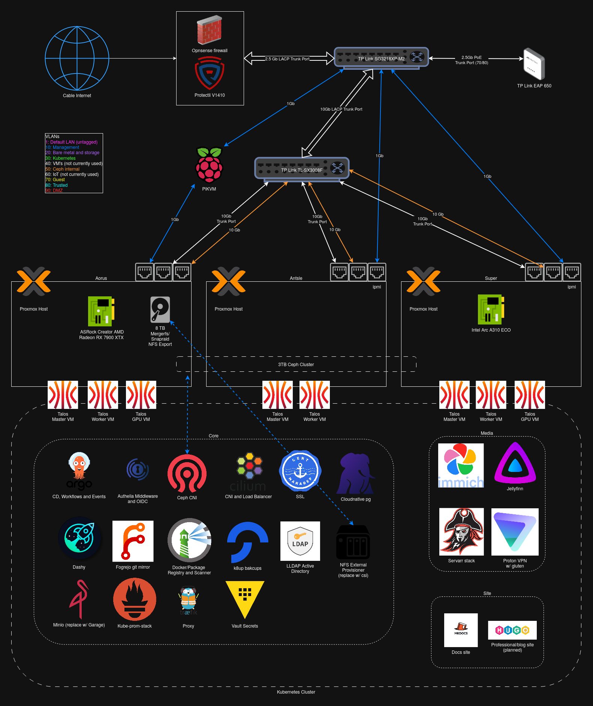

# Overview

This lab is a self-hosted and experimental environment designed to support research and professional development in AI/ML, DevOps, Kubernetes and security. It serves as both a playground for innovation and a production-grade platform built for high availability, scalability, and resilience. By integrating container orchestration, automation, and hybrid cloud capabilities, bhamm-lab.com is engineered to support self-hosted applications and grow my skillset as an AI/ML Engineer and Consultant.

## Key Objectives

- **Learning & Experimentation:**
Research in AI/ML, DevOps, and security.

- **AI/ML Services:**
Build an environment that supports AI/ML workloads with an anti-Nvidia mindset.

- **Robust Self-Hosting:**
Create a resilient infrastructure for self-hosting with scalability, high availability, security and disaster recovery.

- **Hybrid Cloud Integration:**
Integrate on-premises infrastructure with cloud resources (e.g., GCP) for backups, failover and AI/ML workloads.

## Lab at a Glance

- **Core Infrastructure:**
A blend of bare-metal servers (Debian), virtualized environments (Proxmox), and container orchestration (Talos).

- **GPU Workloads:**
Leverage AMD and Intel gpu opperators to power AI/ML and encoding applications with a Raedon 7900xtx and Arc A310 (and pre-ordered Framwork motherboard).

- **Automation Tools:**
A suite of tools such as Terraform, Ansible, and Argo CD automates provisioning, configuration, and deployment processes.

- **Cloud Integration:**
Strategic use of Google Cloud Platform (GCP) for hybrid backup strategies, disaster recovery, high availability and access to Vertex AI Platform.

- **Security Measures:**
Implement best practices in security, including network segmentation, access controls, and secrets management using SOPS and Vault.

- **Storage & Data Management:**
Distributed storage solutions including Ceph, Snapraid/mergerfs and GCP storage ensuring cloud-native, 3-2-1 backups with data redundancy and high availability.

- **Networking:**
Advanced network designs featuring Opnsense firewall, TP Link Omada equipment, robust VLANs and secure connectivity.

## Design Principles

### Scalable and Robust Design

- **Robust Infrastructure:**
Doing things 'the hard way' to mimic enterprise-like hybrid cloud environments. Carefully choosing open source tooling which is commonly seen in enterprise environments. Ensuring services are HA and alerts are configured for downtime.

- **Monorepo:**
Preferring a 'monorepo' approach with infrastructure defined as code when possible. Tightly coupled architecture with many dependencies and automation to address 'chicken and egg' as much as possible.

- **Overengineered?**
Most likely over-engineered for a homelab; prioritizing learning over simplicity. Hoping to inspire homelabbers who want an enterprise approach, while recognizing this isn't the setup for most.

### Container First

- **Kubernetes-Centric:**
Core services and applications are containerized and deployed on Kubernetes (talos), preferring cloud native tooling over a Linux admin approach.

- **Portability:**
Containerized applications can be easily migrated or replicated across different environments, including on-premises and cloud setups.

### Automation and Infrastructure as Code

- **CI/CD Pipelines:**
Emphasis on continuous integration and continuous deployment ensuring rapid, reliable updates and consistent environments. Leveraging argo events and workflows to create a blue/green deployment strategy.

- **Declarative Configurations:**
Tools like Terraform, Ansible, and Argo CD allow the infrastructure to be defined as code, enhancing reproducibility, version control, and disaster recovery.

- **Self-Healing Systems:**
Automation enables the detection and remediation of issues quickly, reducing downtime and manual intervention. Ensures a thoughtful approach to enable spinning up/down environments as needed.

### Disaster Recovery and Resilience

- **Redundancy & Backup:**
Multiple layers of backup and replication (using Ceph, ZFS, SnapRAID, MergerFS, etc.) ensure data integrity and continuity in the event of failure (while accepting NFS as a single point of failure for long term/larger storage).

- **Regular DR Drills:**
Routine testing of disaster recovery to ensure procedures are effective and up-to-date. Careful documentation to ensure data is recoverable.

- **Resilience:**
The design incorporates failover mechanisms and high-availability configurations to minimize downtime and ensure service continuity.

### Hybrid Cloud

- **Cloud-Integrated Backups:**
Utilizes cloud resources (notably GCP) to augment on-premises backups, providing additional layers of redundancy and scalability. Planned work to failover VM's from bare metal to GCP.

- **AI and Compute Offloading:**
The hybrid approach allows for leveraging GCP Vertex AI APIs and additional compute power, enhancing the lab’s capabilities for machine learning tasks.

### Security and Compliance

- **Best Practices:**
Implements stringent security measures including network segmentation, role-based access controls, and encrypted communications.

- **Secrets Management:**
Uses tools like SOPS and Vault to manage sensitive information securely and ensure that credentials and keys are safeguarded.

- **Compliance and Auditing:**
Regular reviews and audits ensure that the infrastructure adheres to industry standards and regulatory requirements.

## Roadmap

- **Short Term:**
  - Publicly expose static docs and professional hugo website.
  - Leverage Intel kuberentes operator and Arc A310 with Immich ML and Jellyfin transcoding.
  - Leverage AMD kuberentes operator and Raedon 7900xtx for OpenwebUI and ollama (or vllm) as a self-hosted ChatGPT replacement.
  - Enhance CI/CD pipelines and migrate from dev/prod to blue/green deployment approach
  - Expose wireguard vpn for offsite access.

- **Mid Term:**
  - Enhance security with auditing tools and packet inspection.
  - Improve alerting capabilities to improve uptime and identify root cause quickly.
  - Deepen integration with GCP for hybrid cloud functionalities and AI API access.
  - Explore agentic frameworks like PydanticAI, LangGraph, DSPy and n8n to automate docs site updates

- **Long Term:**
  - Enable HA and failover from bare metal to GCP in case of cable internet issues or other hardware failures.
  - Evolve the lab into a fully modular, scalable environment capable of supporting large-scale AI and ML projects (with 2x framework motherboards).
  - Collaborate and add more users to build out hackathon-style projects with.
