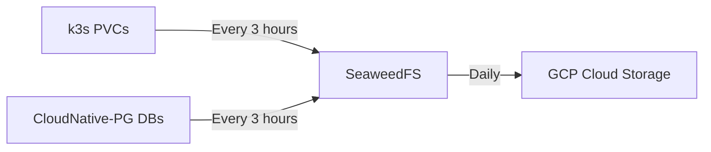
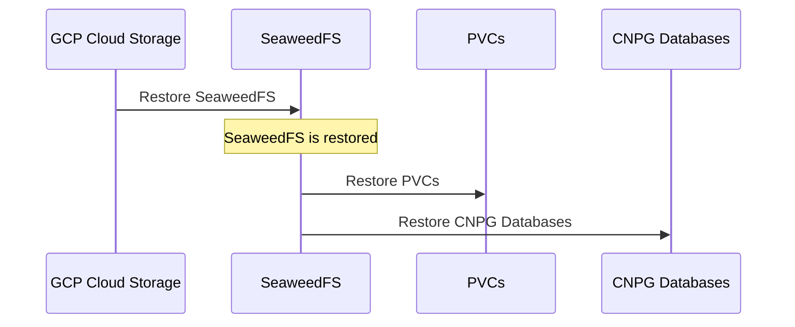

# Overview

- **Purpose**: Rapid restoration of critical data and infrastructure using Infrastructure-as-Code (IaC) with minimal manual intervention
- **Core Principle**: Treat servers and clusters as cattle, not pets - rebuild via automation
- **Scope**:
  - Critical Data: Kubernetes PVCs and CloudNative-PG databases
  - IaC-Managed Infrastructure: Proxmox, OPNsense, Talos VMs, Kubernetes apps

## Backup Architecture

## Backup Components
| Component         | Tool/Method       | Frequency | Location         |
|-------------------|-------------------|-----------|------------------|
| Kubernetes PVCs   | k8up              | 3 hrs     | Minio/NFS        |
| PostgreSQL DBs    | CloudNative-PG    | 3 hrs     | Minio/NFS (separate bucket) |
| Minio Bucket Data | PVC Backup        | Daily     | GCP Storage      |

## Restoration Workflow
1. **Infrastructure Recovery**:
    - Proxmox: Install Debian and rebuild via Ansible playbooks
    - OPNsense: Install latest, configure auth and reconfigure via Ansible
    - Kubernetes: Redeploy via Terraform + ArgoCD (GitOps)

2. **Data Recovery**:

## Future Enhancements

1. **Enhanced Recovery Reliability**:
    - Define RTO and building testing environment

2. **Automation Focus**:
    - Deprecated hardware-specific recovery steps

3. **Hybrid Cloud High Availability**:
    - Enable failover to GCP if cable internet goes down

## Related Documents
- [Cloudnative PG](cloudnative_pg.md): PostgreSQL backup/restore details
- [Kubernetes PVC](kubernetes.md): k8up configuration and procedure
