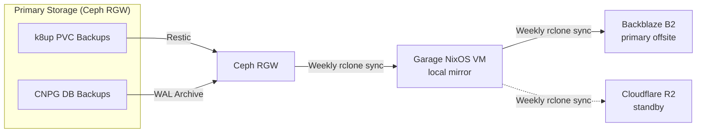
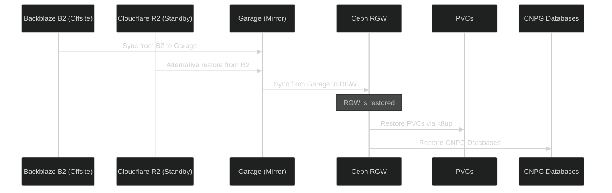

# Overview

- **Purpose**: Rapid restoration of critical data and infrastructure using
  Infrastructure-as-Code (IaC) with minimal manual intervention
- **Core Principle**: Treat servers and clusters as cattle, not pets - rebuild
  via automation
- **Scope**:
  - Critical Data: Kubernetes PVCs and CloudNative-PG databases
  - IaC-Managed Infrastructure: Proxmox, OPNsense, Talos VMs, Kubernetes apps

## Backup Architecture

```mermaid
graph LR
  subgraph Primary["Primary Storage (Ceph RGW)"]
    K[k8up PVC Backups]
    C[CNPG DB Backups]
  end

  K -->|Restic| RGW[Ceph RGW]
  C -->|WAL Archive| RGW

  RGW -->|Weekly rclone sync| GARAGE[Garage NixOS VM<br>local mirror]
  GARAGE -->|Weekly rclone sync| B2[Backblaze B2<br>primary offsite]
  GARAGE -.->|Weekly rclone sync| R2[Cloudflare R2<br>standby]
```

## Backup Components

| Component        | Tool/Method    | Frequency | Location    |
| ---------------- | -------------- | --------- | ----------- |
| Kubernetes PVCs  | k8up           | 3 hrs     | Ceph RGW    |
| PostgreSQL DBs   | CloudNative-PG | 3 hrs     | Ceph RGW    |
| Ceph RGW Mirror  | rclone (Argo)  | Weekly    | Garage → B2 |
| Framework Laptop | Restic         | Daily     | Ceph RGW    |

## Restoration Workflow

1. **Infrastructure Recovery**:
   - Proxmox: Install Debian and rebuild via Ansible playbooks
   - OPNsense: Install latest, configure auth and reconfigure via Ansible
   - Kubernetes: Redeploy via OpenTofu + ArgoCD (GitOps)

2. **Data Recovery**:

```mermaid
---
config:
  theme: 'dark'
---
sequenceDiagram
    participant b2 as Backblaze B2 (Offsite)
    participant r2 as Cloudflare R2 (Standby)
    participant garage as Garage (Mirror)
    participant rgw as Ceph RGW
    participant pvc as PVCs
    participant cnpg as CNPG Databases

    b2->>garage: Sync from B2 to Garage
    r2->>garage: Alternative restore from R2
    garage->>rgw: Sync from Garage to RGW
    Note over rgw: RGW is restored
    rgw->>pvc: Restore PVCs via k8up
    rgw->>cnpg: Restore CNPG Databases
```

## Recovery Source Order

1. **Garage** (local VM, fastest) — primary restore source
2. **Backblaze B2** (offsite) — if Garage is unavailable
3. **Cloudflare R2** (standby) — if both Garage and B2 are unavailable

## Future Enhancements

- **Hybrid Cloud High Availability**:
  - Enable failover to GCP if cable internet goes down

## Related Documents

- [Cloudnative PG](cloudnative_pg.md): PostgreSQL backup/restore details
- [Kubernetes PVC](kubernetes.md): k8up configuration and procedure
- [Framework Laptop](framework.md): Restic backup to Ceph RGW
- [Garage](../operations/garage.md): Local backup mirror VM
