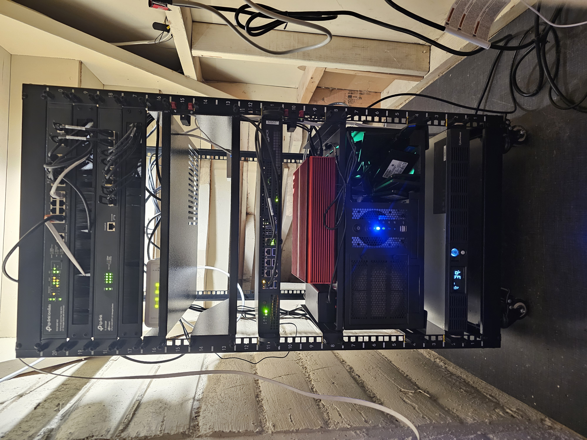

# Welcome to my homelab

<!---->
 

Welcome to my personal lab for exploring AI/ML, DevOps, and security. I've built a resilient, open-source platform by combining bare-metal servers, virtualization, and container orchestration. It's a place for learning, tinkering, and maybe over-engineer a solution or two.

## Documentation Structure

The documentation is organized into six main sections:

- **[Architecture](architecture/index.md):** Detailed design, hardware, software stack, and guiding principles
- **[AI/ML](ai/index.md):** AI/ML workloads, GPU acceleration, and inference capabilities
- **[Backups](backups/index.md):** Disaster recovery, 3-2-1 backup strategy, and cloud integration
- **[Deployments](deployments/index.md):** CI/CD pipelines, GitOps, and infrastructure provisioning
- **[Operations](operations/index.md):** Day-to-day practices, monitoring, and troubleshooting
- **[Security](security/index.md):** Network security, secrets management, and access controls

## Roadmap

- **Short-term:** Build personal website for blogs and project showcase
- **Mid-term:** Run MiniMax with llama.cpp grpc accross two Strix Halo system
- **Long-term:** Fine-tuning generative models, Home Assistant integration

*Github issues are more up to date with detailed task tracking.*
