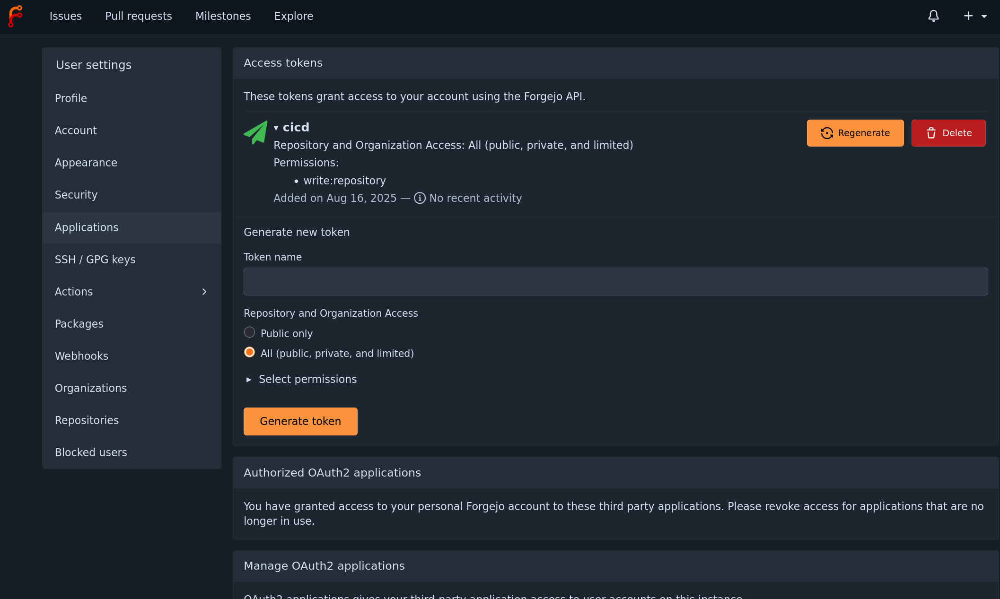

# Git
Some useful troubleshooting tips for gitea

```bash
# Set gitea as origin for git cli
git remote set-url origin git@github.com:blake-hamm/bhamm-lab.git # For gh
git remote set-url origin ssh://git@git.bhamm-lab.com:4185/blake-hamm/bhamm-lab.git # For forgejo
```

*When setting up the argo webhook follow this:*


*And ensure you setup a repo user with these permissions:*


## Source of Truth

While this repository is publicly visible on [GitHub](https://github.com/blake-hamm/bhamm-lab), the operational source of truth for all GitOps and infrastructure-as-code workloads lives on [Codeberg](https://codeberg.org/bhamm-lab/bhamm-lab). ArgoCD, OpenTofu, and all Kubernetes manifests point to the Codeberg remote.

Why Codeberg? Because [GitHub goes down](https://isgithubcooked.com/) and I prefer my GitOps not to depend on whether Microsoft is having a good day. Codeberg runs [Forgejo](https://forgejo.org/) — the same software I self-host internally.
