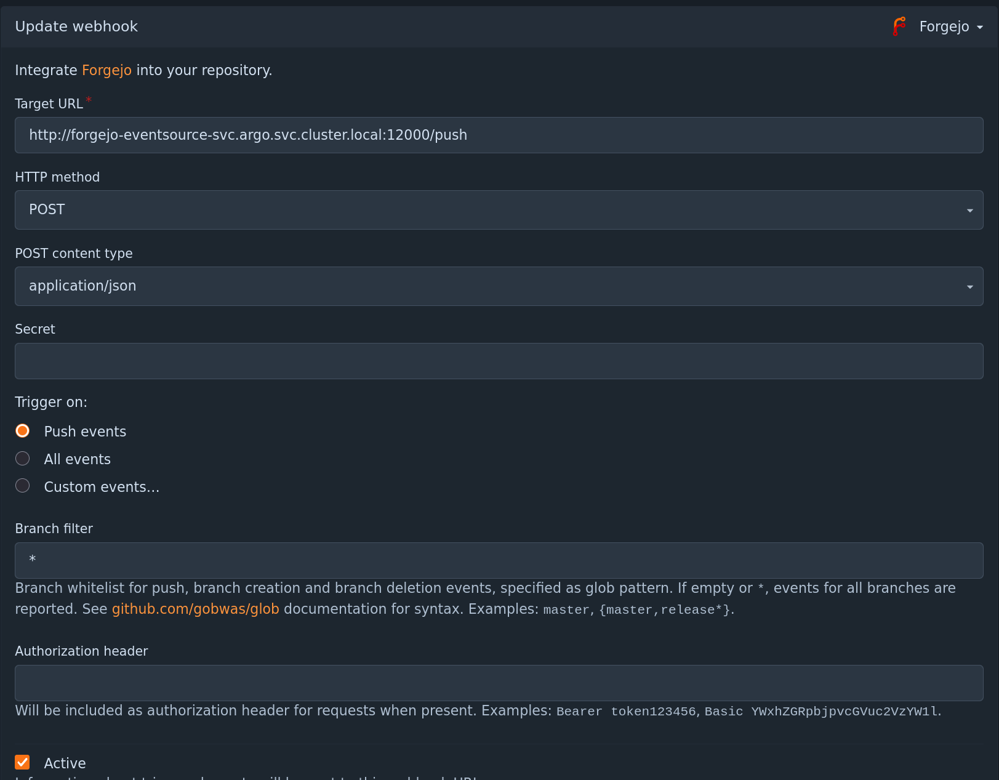
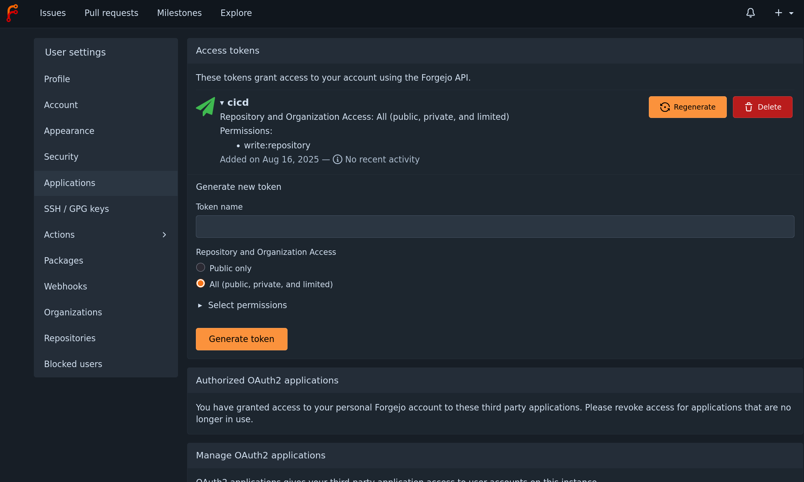

# Git
Some useful troubleshooting tips for gitea

```bash
# Set gitea as origin for git cli
git remote set-url origin git@github.com:blake-hamm/bhamm-lab.git # For gh
git remote set-url origin ssh://git@git.bhamm-lab.com:4185/blake-hamm/bhamm-lab.git # For forgejo
```

*When setting up the argo webhook follow this:*


*And ensure you setup a repo user with these permissions:*


## Source of Truth

While this repository is publicly visible on [GitHub](https://github.com/blake-hamm/bhamm-lab), the operational source of truth for all GitOps and infrastructure-as-code workloads lives on [Codeberg](https://codeberg.org/blake-hamm/bhamm-lab). ArgoCD, OpenTofu, and all Kubernetes manifests point to the Codeberg remote.

Why Codeberg? Because [GitHub goes down](https://isgithubcooked.com/) and I prefer my GitOps not to depend on whether Microsoft is having a good day. Codeberg runs [Forgejo](https://forgejo.org/) — the same software I self-host internally.

## Forgejo Actions Runner

The green cluster runs a self-hosted [Forgejo Actions](https://forgejo.org/docs/latest/admin/actions/) runner so this repository can use native Actions workflows (see `.forgejo/workflows/`).

- **Namespace:** `git-actions` (green only), `pod-security.kubernetes.io/enforce: privileged` — the runner pod runs a docker-in-docker sidecar and job containers on the host network.
- **Chart:** `code.forgejo.org/forgejo-helm/forgejo-runner.git`, pinned to a commit SHA in the `git-actions` ArgoCD app (`kubernetes/manifests/core/forgejo/runner-helm-green.yaml`). The chart has no tags, releases, or OCI publication.
- **Registration:** a helm pre-install job runs `forgejo-runner register` using `CONFIG_INSTANCE`/`CONFIG_NAME`/`CONFIG_TOKEN` from the `git-actions-external-secret` secret (rendered by the `git-actions-common` app from the Vault path `core/forgejo-runner`, which is synced from `secrets.enc.json`).
- **Runner label:** `docker` (default registration label, `docker://data.forgejo.org/oci/node:lts` job image). Workflows select it with `runs-on: docker`.
- **Smoke test:** `.forgejo/workflows/smoke-test.yml` runs on every PR and on manual dispatch; it has no external action dependencies and validates the runner, dind, and job image pull end-to-end.

### Rotating the registration token

1. In the Forgejo UI: **Settings → Actions → Runners** — delete the old runner, create a new one (name `green`), copy the one-time registration token.
2. Encrypt it into `secrets.enc.json` under `vault_secrets.core.forgejo-runner.REGISTRATION_TOKEN` (SOPS/GCP KMS) and commit.
3. The Argo Workflows `sops-vault-sync` job pushes it to Vault; the ExternalSecret picks it up within its 30m refresh (or force-refresh the ExternalSecret).
4. Delete the runner deployment pod (or the helm release secret) so the register job re-runs with the new token.
