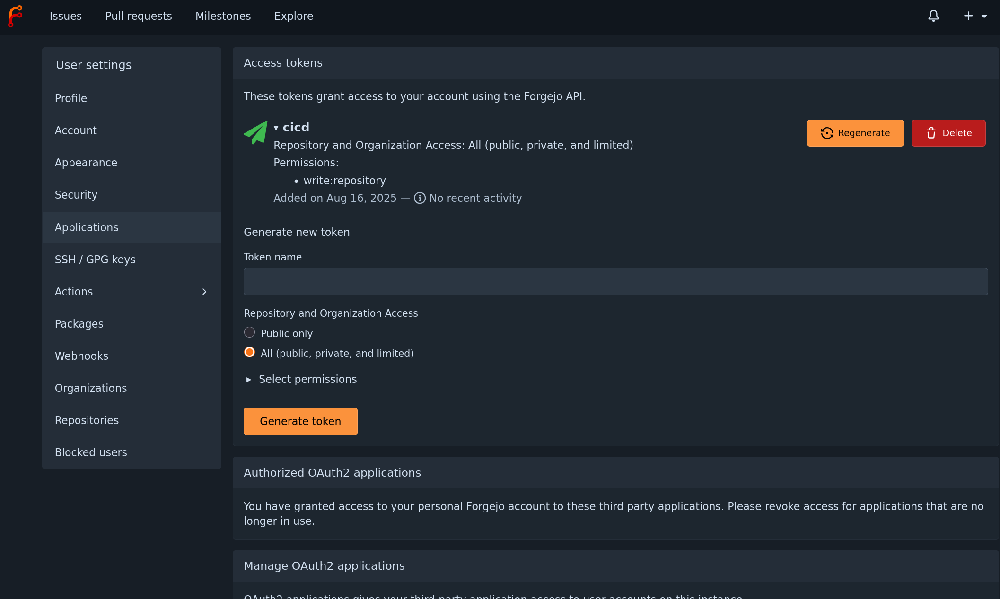

# Git
Some useful troubleshooting tips for gitea

```bash
# Set gitea as origin for git cli
git remote set-url origin git@github.com:blake-hamm/bhamm-lab.git # For gh
git remote set-url origin ssh://git@git.bhamm-lab.com:4185/blake-hamm/bhamm-lab.git # For forgejo
```

*When setting up the argo webhook follow this:*


*And ensure you setup a repo user with these permissions:*

