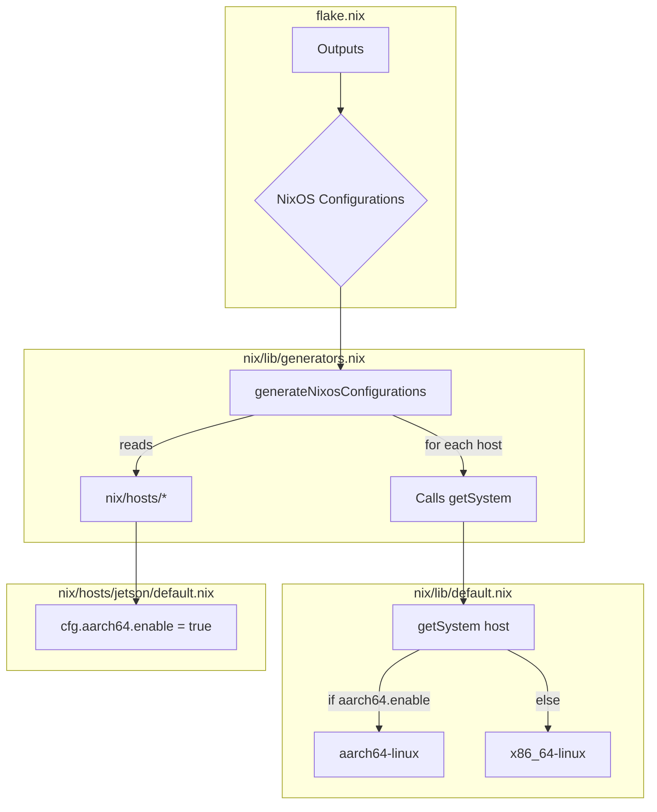

# Plan to Add `aarch64` Support to Nix System

This document outlines the plan to add `aarch64` support to the Nix system, maintaining the existing feature flag approach and enabling cross-compilation from `x86_64` to `aarch64`.

## Executive Summary

The current Nix setup has the system architecture hardcoded to `x86_64-linux`. To support `aarch64`, we will make the following changes:

1.  **Dynamic Architecture Selection**: Modify the core library to determine the architecture based on a feature flag in the host configuration.
2.  **Generator Updates**: Update the configuration generators to respect the host-specific architecture.
3.  **Host Configuration**: Introduce an `aarch64.enable` flag in the host files.
4.  **Cross-Compilation**: Enable cross-compilation in the `flake.nix` to allow building `aarch64` images on `x86_64` machines.

## Proposed Changes

### 1. Modify `nix/lib/default.nix`

The `system` attribute in `nix/lib/default.nix` will be changed from a static string to a function that resolves the architecture based on the host configuration.

```nix
{
  username = "bhamm";
  # system = "x86_64-linux"; # This will be removed
  getSystem = host: if host.cfg.aarch64.enable then "aarch64-linux" else "x86_64-linux";
  sshPort = 4185;
  nixVersion = "25.11";

  # Generator functions
  generators = import ./generators.nix;
}
```

### 2. Modify `nix/lib/generators.nix`

The generator functions in `nix/lib/generators.nix` will be updated to pass the host configuration to the `getSystem` function. This will ensure that each host is built with the correct architecture.

*(The exact changes will be determined after reviewing `nix/lib/generators.nix`)*

### 3. Create a new `aarch64` Host

A new host file will be created at `nix/hosts/jetson/default.nix` to demonstrate the `aarch64` configuration.

```nix
# nix/hosts/jetson/default.nix
{
  deploy = {
    tags = [ "jetson" "remote" "server" ];
    targetHost = "jetson.local";
    allowLocalDeployment = false;
  };

  imports = [
    ./../../profiles/server.nix
  ];

  cfg = {
    aarch64.enable = true;
    wireguard.enable = true;
  };
}
```

### 4. Add Cross-Compilation Support to `flake.nix`

To enable building `aarch64` images on an `x86_64` machine, we will configure `binfmt` and `crossSystem` in `flake.nix`.

```nix
# flake.nix
{
  # ... inputs
  outputs = { nixpkgs, self, ... } @ inputs:
    let
      # ...
    in
    {
      # ...
      nixosConfigurations = {
        # ...
      } // gen.generateNixosConfigurations;

      # Add this to enable cross-compilation
      nixpkgs.overlays.default = (final: prev: {
        nixosSystem = args: prev.nixosSystem (args // {
          crossSystem = prev.lib.systems.examples.aarch64-linux;
        });
      });

      system = "x86_64-linux";
      boot.binfmt.emulatedSystems = [ "aarch64-linux" ];
    };
}
```

## Mermaid Diagram



## Next Steps

1.  Create a new todo list for the implementation.
2.  Request the user to switch to `code` mode to apply the changes.
