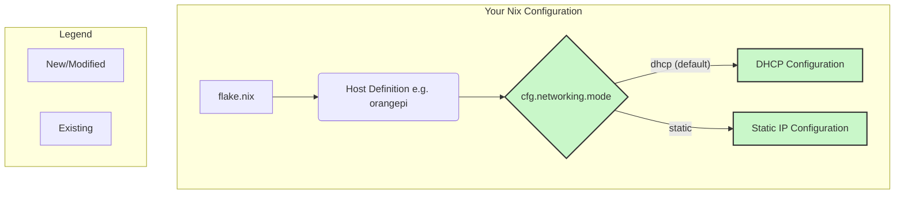

# Plan for Orange Pi SD Card Image

This plan outlines the steps to create a NixOS SD card image for the Orange Pi Zero 3.

## Todo

- [ ] Create a new file `nix/modules/hardware/orangepi-zero-3.nix` to hold the sd-image configuration.
- [ ] Find the correct U-Boot package for the Orange Pi Zero 3.
- [ ] Update `nix/hosts/orangepi/default.nix` to import the new module.
- [ ] Create a new flake output for the sd-image, `images.orangePiZero3`.
- [ ] Review and refine the configuration.

## Implementation Details

### 1. Create `nix/modules/hardware/orangepi-zero-3.nix`

This file will contain the core logic for building the SD card image, adapted from the user's example. It will include:

- The `sd-image-aarch64.nix` module.
- Kernel configuration.
- Bootloader configuration.

### 2. Find U-Boot Package

I will search for a pre-built U-Boot package for the Orange Pi Zero 3 in nixpkgs. If one is not available, I will configure a build from source within `orangepi-zero-3.nix`.

### 3. Update `nix/hosts/orangepi/default.nix`

I will add `../modules/hardware/orangepi-zero-3.nix` to the `imports` of this file.

### 4. Create Flake Output

I will add the following to `flake.nix`:

```nix
      images = {
        orangePiZero3 = self.nixosConfigurations.orangepi.config.system.build.sdImage;
      };
```

## Networking Architecture

The current networking configuration assumes a static IP and fails when one is not provided. The following plan will refactor the networking module to default to DHCP while still allowing for static IP configurations.

### Todo

- [ ] Add a `mode` option to `cfg.networking` in `nix/modules/network/options.nix` with possible values `"dhcp"` (default) and `"static"`.
- [ ] Update `nix/modules/network/network.nix` to use DHCP or a static IP based on the `cfg.networking.mode` option.

### Diagram


